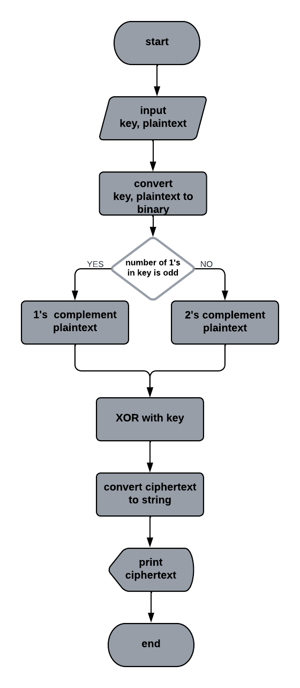
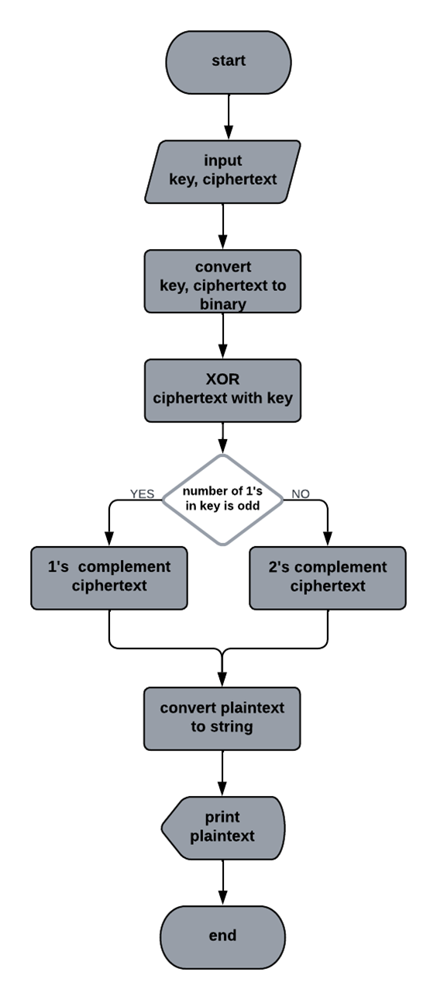
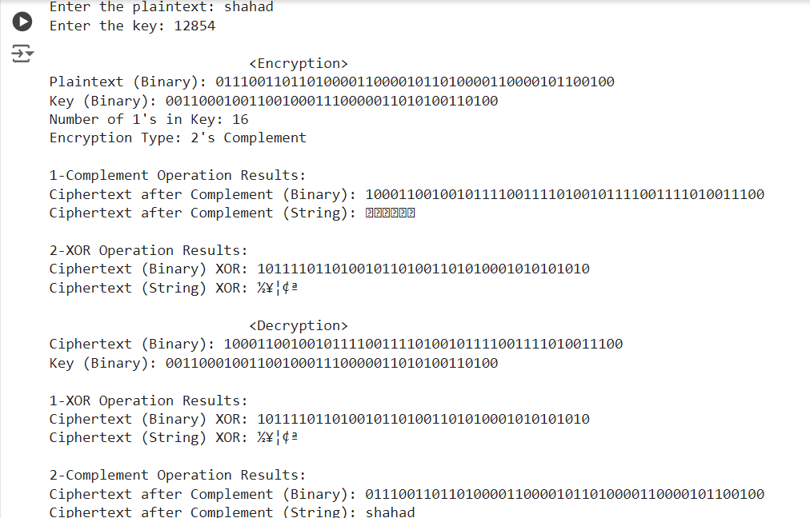

# Simple Encryption and Decryption Algorithm using Python

## Overview

The Simple Encryption and Decryption Algorithm is a bit-oriented scheme designed to securely encrypt and decrypt messages using a binary key. This algorithm leverages concepts of one's complement, two's complement, and XOR operations to provide a robust encryption mechanism. The implementation is done in Python, making it accessible and easy to integrate.

## Key Features

- **Binary Representation:** Operates on the binary representations of plaintext and keys, converting characters to 8-bit binary using ASCII values.
- **Key-Based Encryption:** The encryption process is influenced by the user's key, which determines the application of one’s or two’s complement based on the number of '1's in the key.
- **XOR Operation:** Incorporates XOR to enhance security, combining bits from the complemented plaintext and the binary key.

## How It Works

### Encryption Process

1. User inputs plaintext and a key.
2. The algorithm converts both inputs into their binary representations.
3. Depending on the number of '1's in the key:
   - If odd, one’s complement is applied to the plaintext.
   - If even, two’s complement is used.
4. An XOR operation between the complemented plaintext and the binary key generates the ciphertext.
5. The final ciphertext is displayed.

### Encryption Flow Chart

### Decryption Process

1. User provides the ciphertext and the same key used for encryption.
2. The algorithm determines the complement type based on the key.
3. An XOR operation is performed between the ciphertext and the binary key.
4. The original plaintext is retrieved by applying the appropriate complement.
5. The original plaintext is displayed.

### Decryption Flow Chart

## Conclusion

The Simple Encryption and Decryption Algorithm provides a straightforward yet effective way to encrypt and decrypt messages, ensuring data security through binary manipulation techniques. This project is suitable for anyone interested in cryptography and secure data transmission.

### Algorithm Testing

